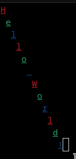

# Intro
crossCurses is a cross platform terminal graphics/control library that is loosely based on ncurses.

# Dependencies
building for Windows will depend on the Windows library (<Windows.h>) building for *Nix will depend on ncurses. MAC/UNIX IS UNTESTED. IT MAY NOT BUILD OR RUN

# Building
there will be a CMake put here later as-well as releases. no need for main.cpp, that is a test file

# Usage
you must initialise the console with `initaliseConsole()` before any other command you can then set the consoles title with `setConsoleTitle` if on Windows

using `setCursorPos` will set the cursor position for any following text writes. text can be written with `writeText` or a single character can be written with `writeChar`

calling `refreshScr()` will write the text buffer the console. it only writes what was changed.

you can set text attributes such as color or boldness with `setAttr` and passing in a `textAttribute` type. the textAttribute struct contains two booleans, `isHighligted` and `isUnderlined`, self explanatory. it also contains an enum `Color` that specifies the structs fg and bg fields.

make sure to end your program with `deInitaliseConsole()` to avoid potential permanent (until console close and re-open) effects.

enjoy \:)

# Bugs
idk there is probably heaps. The Windows and *Nix builds may lead to slightly different outputs despite my efforts